# Blueprint

**The operating system for engineering placement preparation.**

Blueprint is an AI-powered platform that helps engineering students systematically prepare for software engineering internships and placements. Instead of another task tracker, Blueprint measures a student's readiness across DSA, core CS subjects, projects, resume quality, and company-specific prep — then turns that into a personalized, AI-generated weekly plan.

> Students today juggle LeetCode, YouTube, Notion, GitHub, resume builders, and AI chatbots — with no single view of how ready they actually are. Blueprint unifies these signals into one dashboard and tells you what to do next.

---

## Table of contents

- [Features](#features)
- [Tech stack](#tech-stack)
- [Architecture](#architecture)
- [Monorepo structure](#monorepo-structure)
- [Quick start](#quick-start)
- [Environment variables](#environment-variables)
- [Deployment](#deployment)
- [Security & rate limits](#security--rate-limits)
- [Known gaps](#known-gaps)
- [Platform screenshots](#platform-screenshots)
- [Contributing](#contributing)

---

## Features

| Module | What it does | Status |
|---|---|---|
| Auth & onboarding | Supabase Google OAuth, target role + companies, skill self-assessment wizard | Live |
| Dashboard | Readiness score, weekly tasks, profile strength — mix of backend API + direct Supabase reads | Live |
| Weekly Planner | AI-generated or manual weekly plans, per-task tracking | Live |
| Role Roadmap | AI-generated milestone roadmap per target role | Live |
| Interview Hub — DSA | 3,632 coding problems, filterable, per-user solve tracking | Live |
| Interview Hub — Q&A | 33,807 open-ended questions, filterable by category/skill/role | Live |
| Interview Hub — Quiz | 5,816 MCQs, per-user attempt history | Live |
| AI Mentor | Gemini-backed streaming chat (Teacher/Mentor modes), deterministic intent routing | Live |
| Knowledge Vault | Bookmarks, AI insights, and personal notes | Live |
| Resume Analysis | Async PDF extraction + Gemini ATS scoring with a deterministic (non-AI) final score, section + factor breakdown. Re-uploading the same file returns the existing analysis for free; one new file per day | Live |
| In-app notifications | Planner reminders, written directly to the DB (no email) | Live |
| Email delivery | — | **Not built** (see [Known gaps](#known-gaps)) |
| GitHub activity analysis | — | Planned |

---

## Tech stack

| Layer | Technology |
|---|---|
| Frontend framework | React 19 |
| Frontend build tool | Vite |
| Frontend routing | React Router 7 |
| Frontend server-state | `@tanstack/react-query` |
| Frontend client-state | Zustand (auth only) |
| Frontend styling | Tailwind CSS v4 |
| API framework | FastAPI + Uvicorn |
| ORM / migrations | SQLAlchemy 2.x + Alembic |
| Database & Auth | Supabase (Postgres + Google OAuth) |
| Cache / Celery broker | Redis (Upstash) |
| Background jobs | Celery worker (resume analysis only — **no Celery Beat**) |
| Scheduled jobs | GitHub Actions (hourly HTTP trigger → internal endpoint) |
| AI | Google Gemini, via a single `AIGateway` wrapper |
| Frontend hosting | Vercel |
| Backend hosting | Render (single free Web Service) |

---

## Architecture

```
                    Supabase (Postgres + Google OAuth)
                    ▲                          ▲
                    │ session verify           │ reads/writes (backend + some direct
                    │                          │  frontend reads via RLS)
  React SPA ───────▶│      FastAPI (Render)    │──────▶ Gemini API
  (Vercel)           │      ┌───────────────┐  │
                    │      │ Celery worker  │  │──────▶ Redis (Upstash)
                    │      │ (resume        │  │        broker + app cache
                    │      │  analysis only)│  │
                    │      └───────────────┘  │
                    └───────────────────────────┘
                                 ▲
                                 │ hourly HTTPS trigger, shared secret
                        GitHub Actions (planner reminders)
```

Two things worth calling out explicitly since they differ from what you might expect from a typical FastAPI + Celery stack:

1. **No local auth.** The backend never issues its own tokens. It verifies whatever Supabase session token the frontend hands it, by calling Supabase's own API — Supabase is the source of truth for identity.
2. **No Celery Beat, and only one Celery task.** Beat was removed deliberately: the only two jobs it used to schedule were (a) an outbox drain for in-app notifications that are just synchronous DB inserts with no external dependency, and (b) an hourly planner-reminder scan. (a) was replaced by writing notifications directly inline; (b) is now triggered by a GitHub Actions scheduled workflow hitting a shared-secret-protected internal endpoint. The one thing Celery still does — resume analysis — earns its place because it's a genuinely slow Gemini call (up to 120s) that shouldn't block an HTTP request.

Full detail in [`backend/README.md`](./backend/README.md) and [`frontend/README.md`](./frontend/README.md).

---

## Monorepo structure

```
Blueprint/
├── .github/workflows/
│   └── planner-reminders.yml       # hourly GitHub Actions cron → backend internal endpoint
│
├── frontend/                       # React 19 + Vite SPA — see frontend/README.md
│   └── src/
│       ├── App.jsx / main.jsx / api.js
│       ├── lib/supabase.js         # Supabase client
│       ├── components/             # Layout, Sidebar, ProtectedRoute
│       ├── data/                   # static filter-option JSON mirrors
│       ├── pages/                  # Landing, Auth, Onboarding, Dashboard, Planner, Roadmap,
│       │                           #   Mentor, InterviewHub/*, Vault, Profile, ResumeAnalyser, Subjects
│       └── store/authStore.js      # Zustand — auth only
│
└── backend/                        # FastAPI service — see backend/README.md
    ├── main.py                     # app entry point, router registration
    ├── start.sh                    # uvicorn + celery worker (no beat)
    ├── scratch_seed_data.py        # Interview Hub CSV seeder (has a known path bug)
    ├── alembic/versions/           # 13 migrations
    ├── app/
    │   ├── api/                    # auth (GET /me only), profile, onboarding, planner, roadmap,
    │   │                           #   mentor, hub, vault, assessments, notifications, resume, internal
    │   ├── models/                 # one file per domain (User, Profile, Planner, Roadmap, Hub, Vault, …)
    │   ├── ai/gateway.py           # the single Gemini call point
    │   ├── prompts/                # mentor/, resume/, roadmap/ prompt builders
    │   ├── services/               # context_builder, notification_service, mentor/, resume/, roadmap/
    │   ├── workers/                # celery_app (no beat), tasks/ai_tasks.py (resume only),
    │   │                           #   outbox.py/handlers.py/event_types.py (kept but dormant)
    │   └── core/                   # config, cache, role_skills
    └── csv/                        # Interview Hub seed data (~43K rows across 3 tables)
```

---

## Quick start

Requires PostgreSQL/Supabase and Redis.

```powershell
git clone <repo-url>
cd Blueprint_host

# --- Backend ---
cd backend
python -m venv .venv
.\.venv\Scripts\Activate.ps1
pip install -r requirements.txt
copy .env.example .env
# fill in the real variable list from backend/README.md — .env.example itself is stale
alembic upgrade head
uvicorn main:app --reload
```

The Celery worker is only needed to test resume upload locally:

```powershell
celery -A app.workers.celery_app worker --loglevel=info --pool=solo --without-gossip --without-mingle --without-heartbeat
```

```powershell
# --- Frontend ---
cd frontend
npm install
# create .env with VITE_API_URL, VITE_SUPABASE_URL, VITE_SUPABASE_ANON_KEY
npm run dev
```

| Service | URL |
|---|---|
| Frontend | http://localhost:5173 |
| API | http://localhost:8000 |
| Swagger docs | http://localhost:8000/docs |

No Docker/`docker-compose.yml` exists in this repo — local dev is native venv + npm, and deployment is a single Render Web Service (see [Deployment](#deployment)).

---

## Environment variables

See the full, verified lists in [`backend/README.md`](./backend/README.md#environment-variables) and [`frontend/README.md`](./frontend/README.md#environment-variables) — both repos' `.env.example`/`.env` files have drifted from what the code actually reads, and the READMEs document the real names.

---

## Deployment

- **Frontend**: Vercel, auto-deploy from `main`.
- **Backend**: one Render free Web Service running `start.sh` (`uvicorn` + Celery worker — no Beat, no Background Worker service, no Dockerfile).
- **Redis**: Upstash free tier, doubling as the Celery broker and the app-level response cache.
- **Scheduler**: GitHub Actions (`.github/workflows/planner-reminders.yml`), hourly, hits a shared-secret-protected internal endpoint on the backend — replaces what Celery Beat used to do, at zero additional hosting cost. Needs repo secrets `RENDER_APP_URL` and `INTERNAL_TRIGGER_SECRET`; the job has no token permissions and retries for a few minutes because the free-tier backend is usually asleep at the top of the hour.
- **Render env**: set `APP_ENV=production` (disables the public API docs). Free-tier cold starts (~1 min after 15 min idle) are softened by a wake-up ping the frontend sends on every page load.

This shape was deliberately chosen to stay within free tiers without running multiple always-on services — see the commit history / PR discussion around the Celery Beat removal for the full reasoning if you're revisiting this later.

---

## Security & rate limits

**Rate limits** (per user unless noted; day = IST midnight; all configurable via env vars — details in [`backend/README.md`](./backend/README.md#rate-limiting)):

| Feature | Limit |
|---|---|
| AI Mentor | 40 messages per conversation, 60 per day, 6 per minute; 4,000-char messages |
| Resume | same file re-uploaded = free reuse of the existing analysis; 1 new file per day |
| Planner / roadmap (Gemini) | 6 daily plans, 5 weekly plans, 5 roadmap generations per day |
| Whole API | 600 requests/minute per IP (flood guard) |

**Security posture** (full list in [`backend/README.md`](./backend/README.md#security)): Supabase token verified server-side with a 60-second cache; bearer-header auth only (no auth cookie); every ID-based endpoint scoped to the current user; upload validation (PDF magic bytes, size cap, sanitised names); TLS verification on Redis; constant-time internal-secret check; API docs off in production; DOMPurify + security headers on the frontend. The one thing to verify yourself: **Supabase row-level security** on the tables the frontend reads directly (only 5 have policies defined in this repo).

---

## Known gaps

Tracked honestly rather than hidden:

- **Env var drift**: `frontend/.env` sets `VITE_API_URL` but the code reads `VITE_API_BASE_URL`; `backend/.env.example` still lists SMTP/legacy-worker-mode vars that no longer exist in config and is missing vars the app actually needs (`SUPABASE_URL`, `INTERNAL_TRIGGER_SECRET`, etc). Full detail in each sub-README's Known Gaps section.
- **No email delivery is implemented anywhere**, despite some legacy scaffolding (`SMTP_*` env vars, an unused transactional outbox) suggesting otherwise. All notifications are in-app only.
- **The outbox pattern (`OutboxEvent` table, handlers, event types) is intentionally dormant** — kept for a future feature that needs real at-least-once delivery around an external call, but has zero live callers today.
- **`backend/scratch_seed_data.py` hardcodes a stale path** to a differently-named local clone of this repo.
- **No Content-Security-Policy** header on the frontend yet (needs browser testing), and no dependency lockfile on the backend.
- **Supabase RLS coverage is unverified** for most tables that the frontend reads directly — check the Security Advisor in the Supabase dashboard.
- Two frontend data-fetching paths (backend API vs. direct Supabase reads) coexist without a single documented rule for new features — see `frontend/README.md`.

---

## Platform screenshots

### Landing
| Hero | Feature Modules | How It Works |
| :---: | :---: | :---: |
| 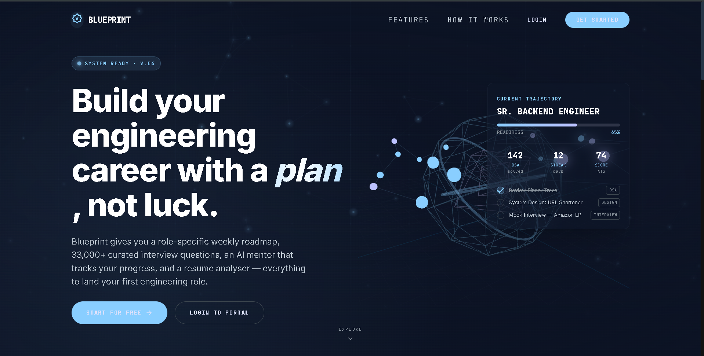 | 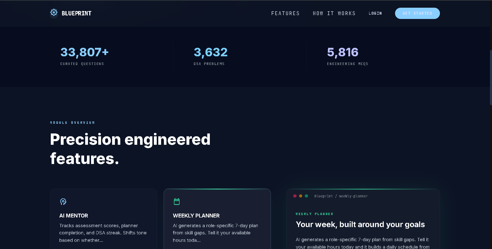 | 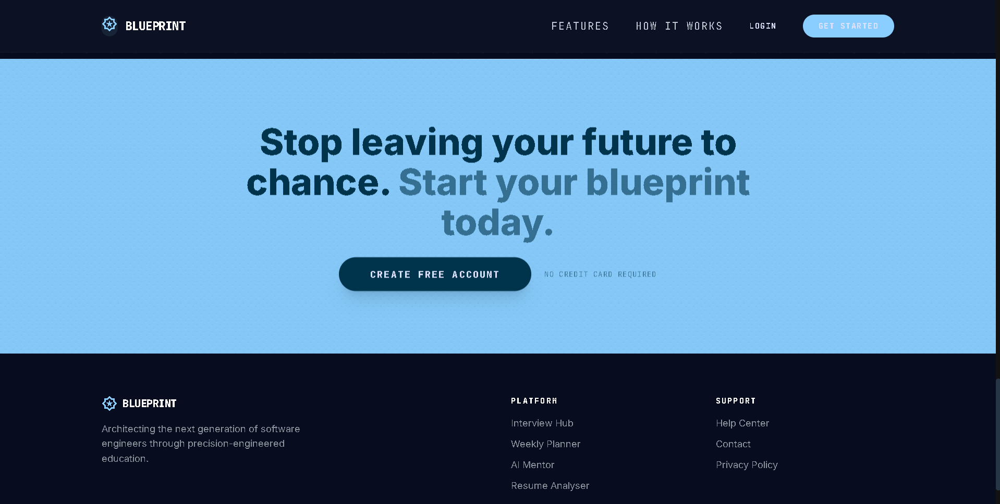 |

### Dashboard & AI Mentor
| Dashboard | Dashboard Metrics | AI Mentor |
| :---: | :---: | :---: |
| 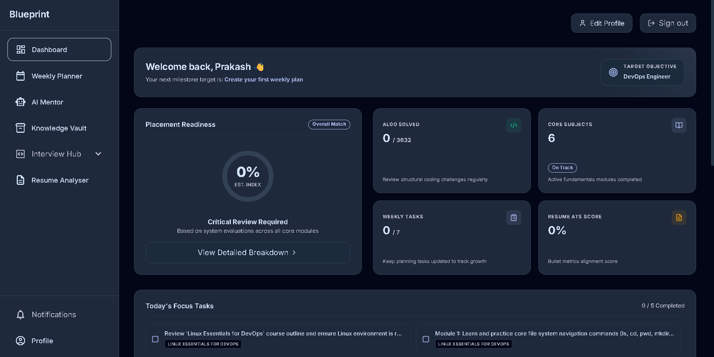 | 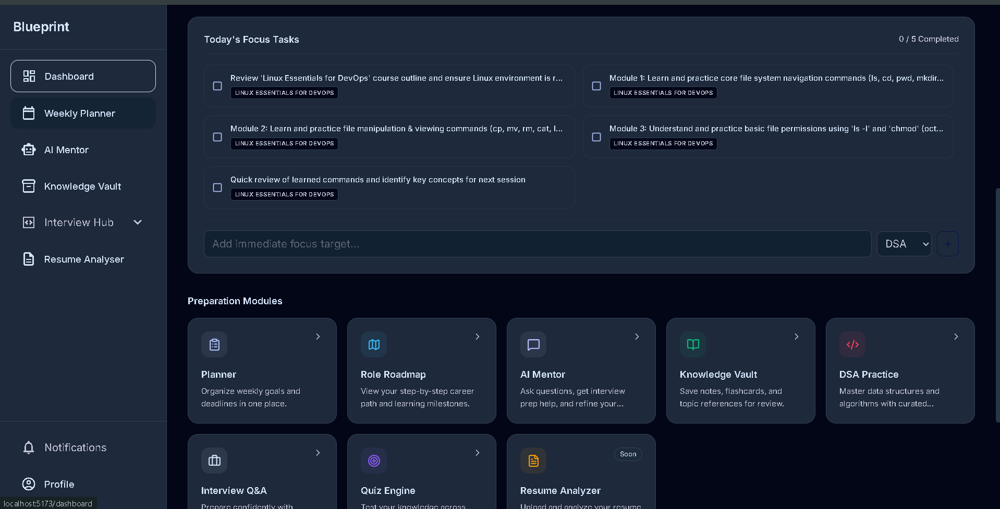 |  |

### Planner & Profile
| Weekly Planner | Edit Profile |
| :---: | :---: |
| 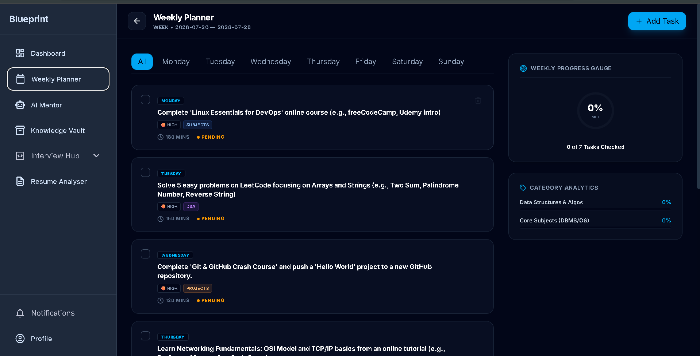 | 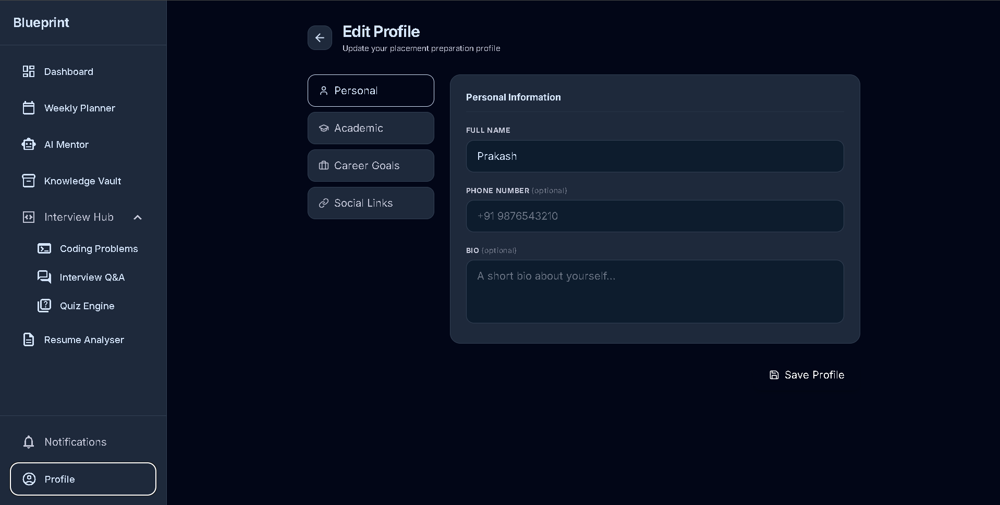 |

### Interview Hub
| DSA Problem List | DSA Workspace | Interview Q&A |
| :---: | :---: | :---: |
| 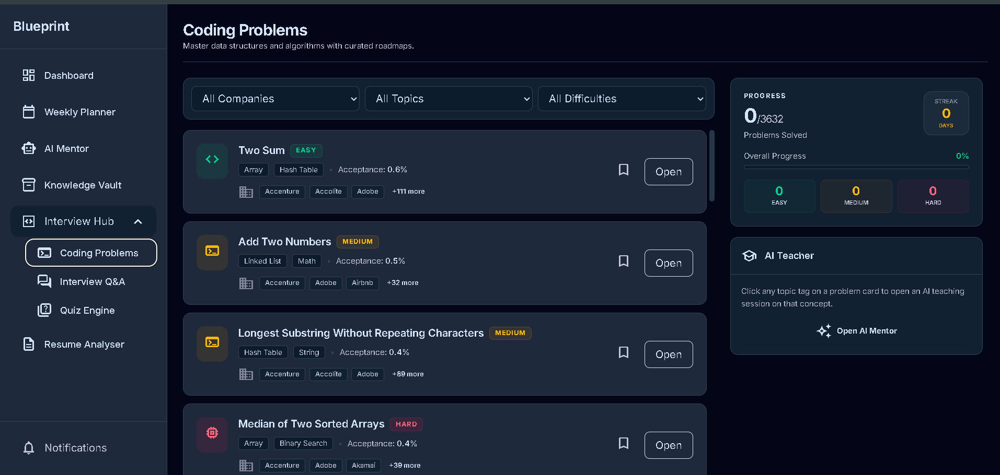 | 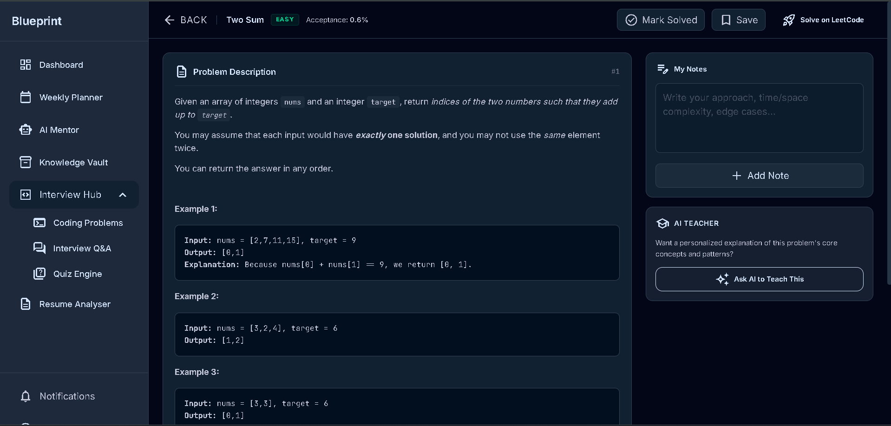 | 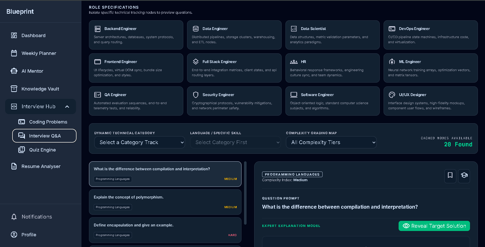 |

### Quiz Engine & Knowledge Vault
| Quiz Overview | Quiz Filters | Quiz Timer | Knowledge Vault |
| :---: | :---: | :---: | :---: |
| 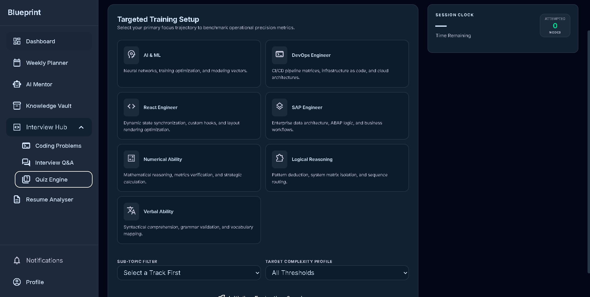 | 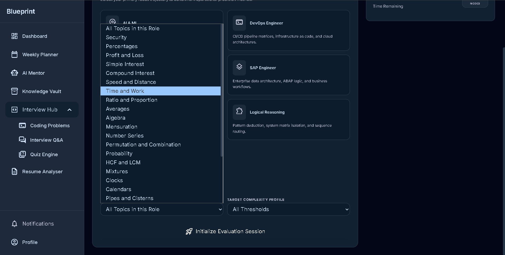 | 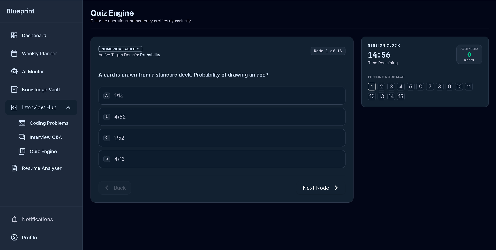 | 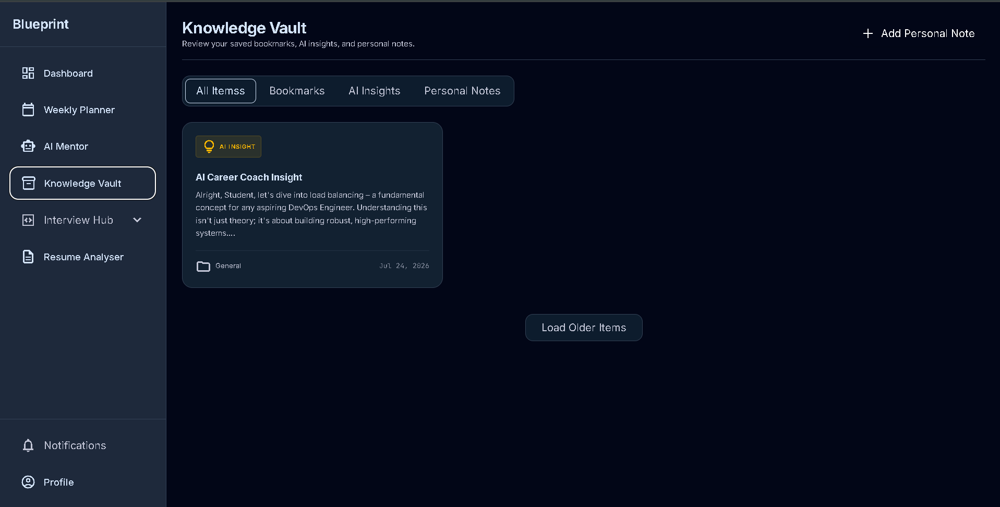 |

---

## Contributing

This repository is under active development. Open an issue or discussion before starting significant work.

- **Frontend**: React functional components, Tailwind for styling, React Query for server state.
- **Backend**: FastAPI + Python type hints, Pydantic validation, Alembic migrations for any schema change.
